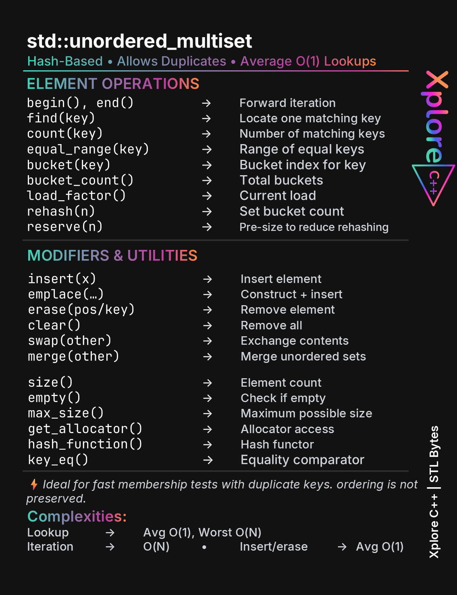
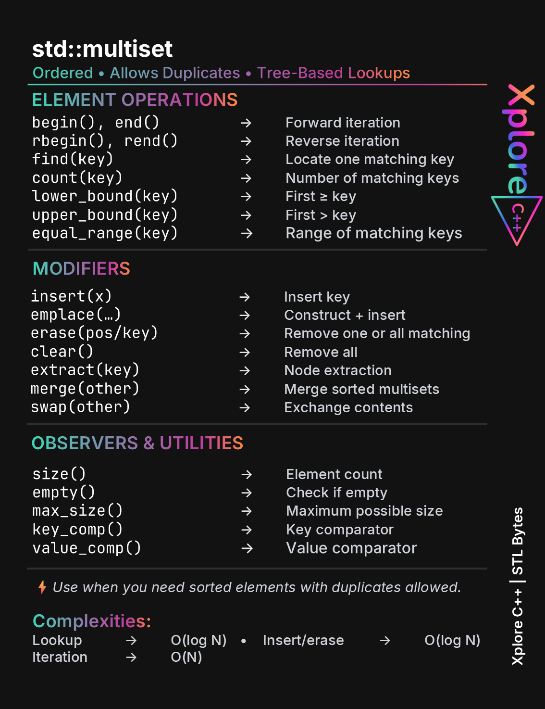
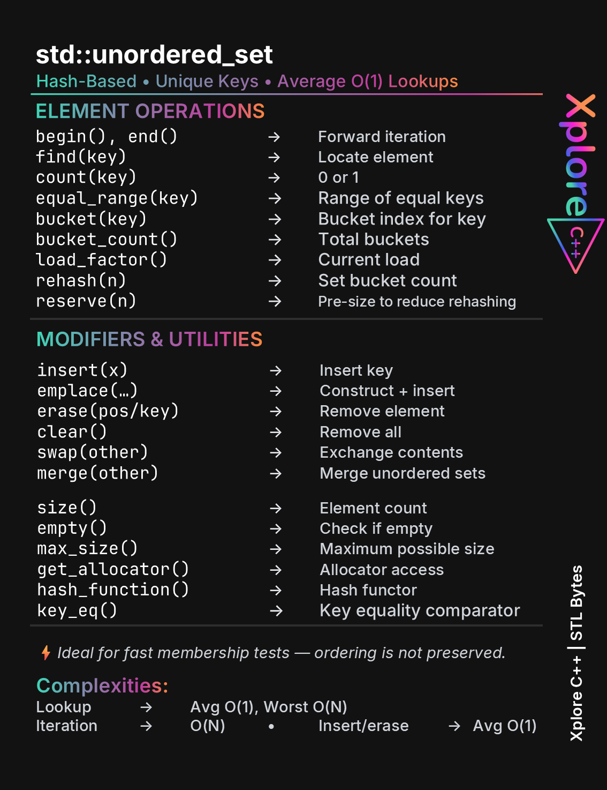
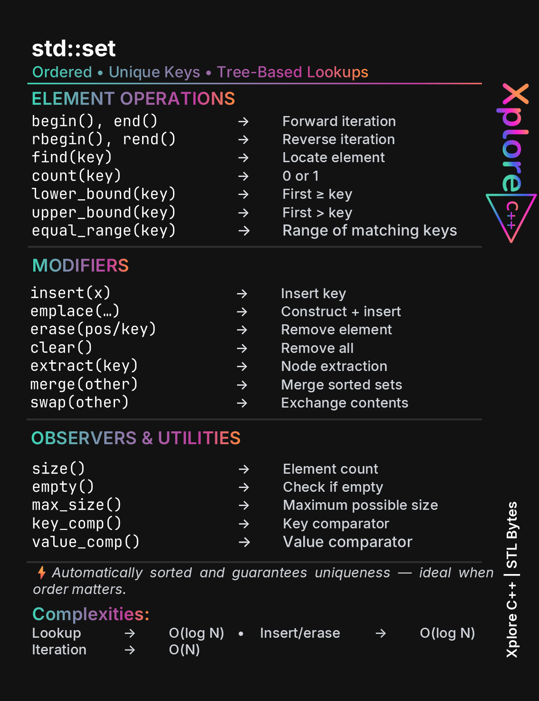
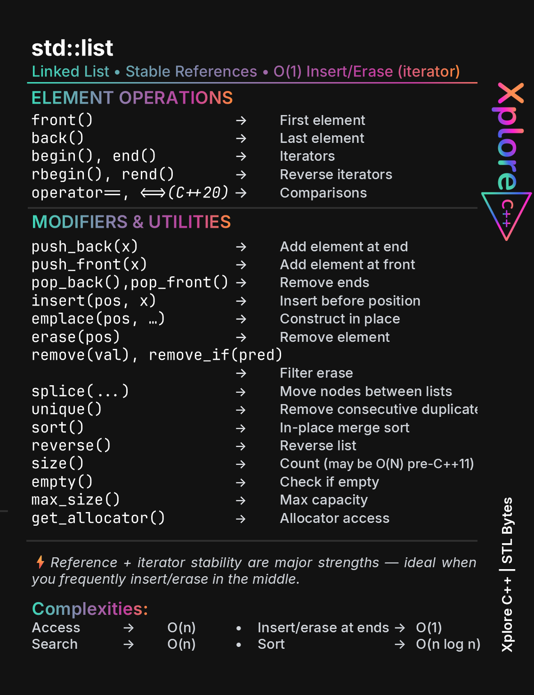
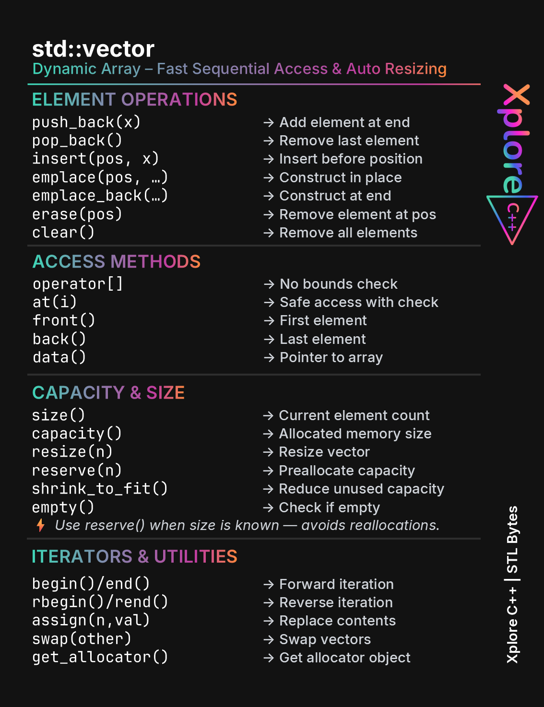
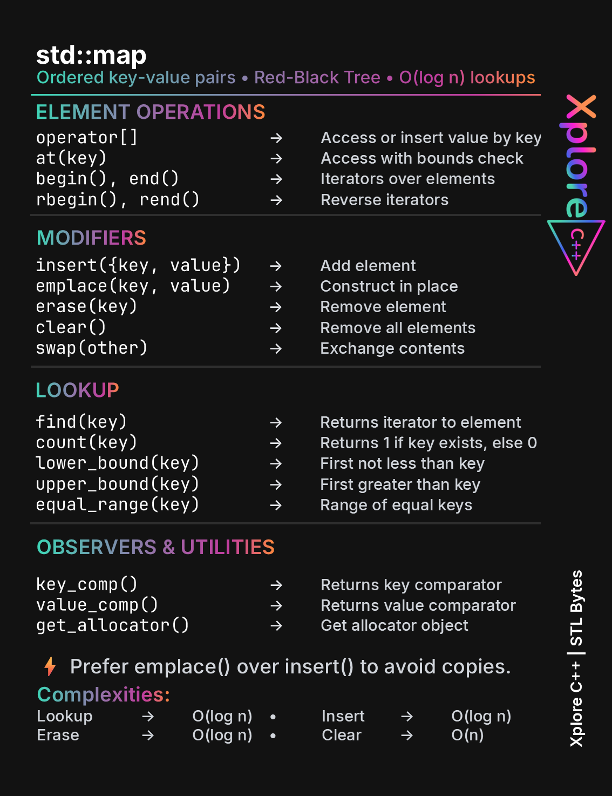
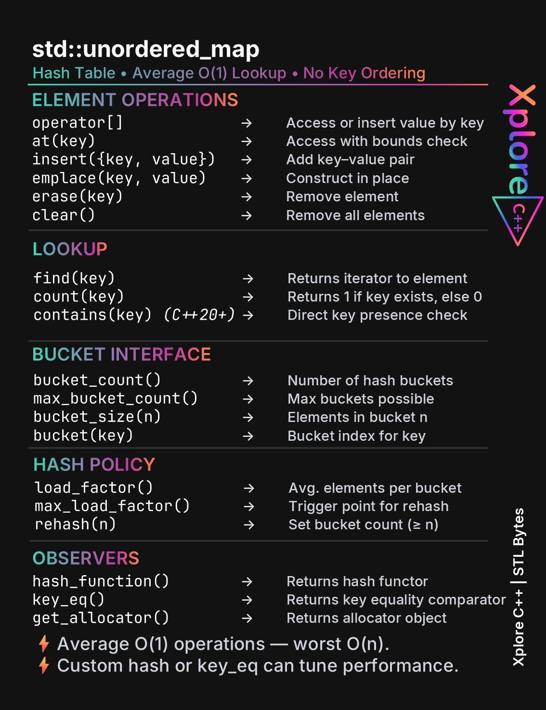
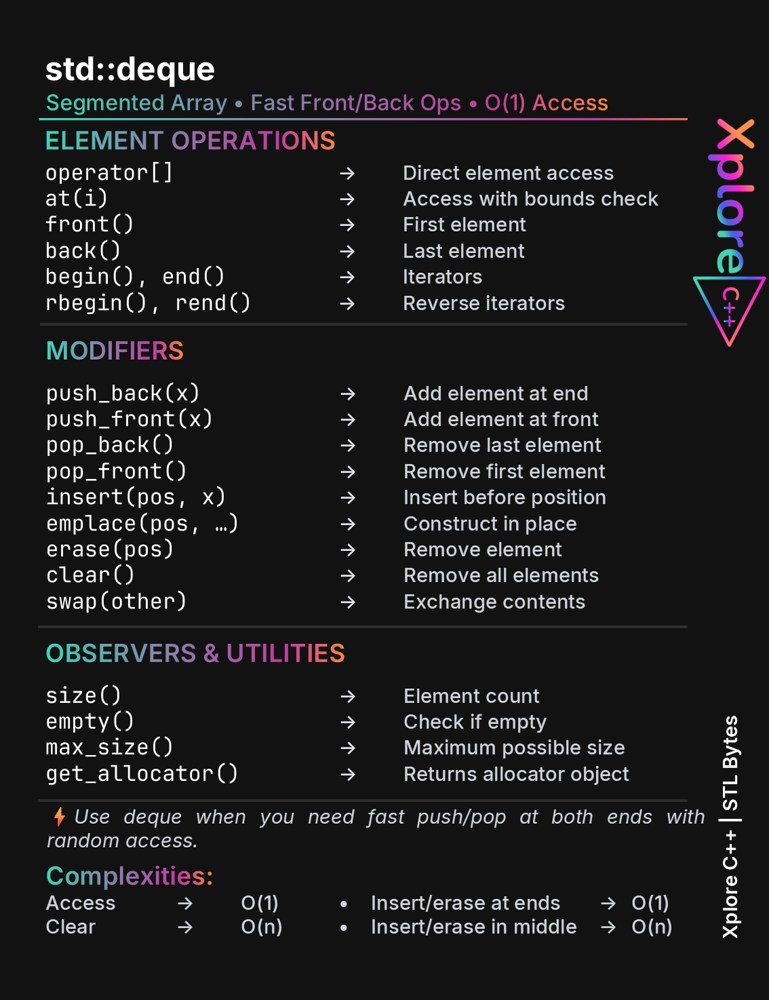

# STLBytes
 This repository contains all content, and resources from the **STLBytes** series —  Bite-sized Modern C++.
 
 Get the latest STLBytes posts on LinkedIn:  
👉 https://www.linkedin.com/search/results/all/?keywords=%23stlbytes&origin=HASH_TAG_FROM_FEED
## 📘 What You’ll Find
- High-quality image cards for each STL container

## ⭐ Like the project?
Star the repo and follow along!

## 🚀 Latest Slides  
### `std::unordered_multiset`

### `std::multiset`

### `std::unordered_set`

### `std::set`

### `std::list`

### `std::vector`

### `std::map`

### `std::unordered_map`

### `std::deque`

---

🔎 **Follow the #STLBytes hashtag for upcoming posts:**  
https://www.linkedin.com/search/results/all/?keywords=%23stlbytes&origin=HASH_TAG_FROM_FEED
More STL containers coming weekly.

**Xplore C++ | STLBytes**
